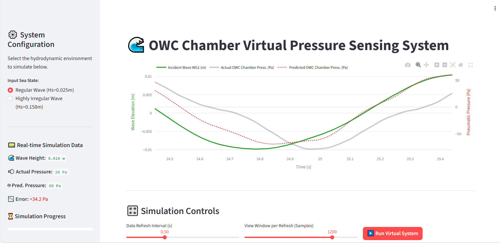
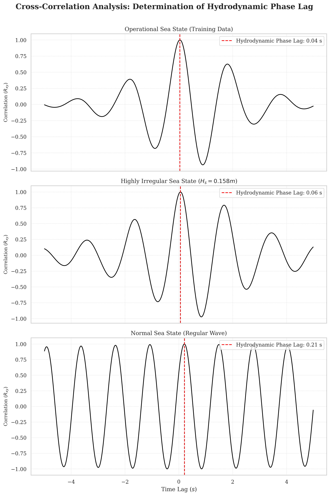
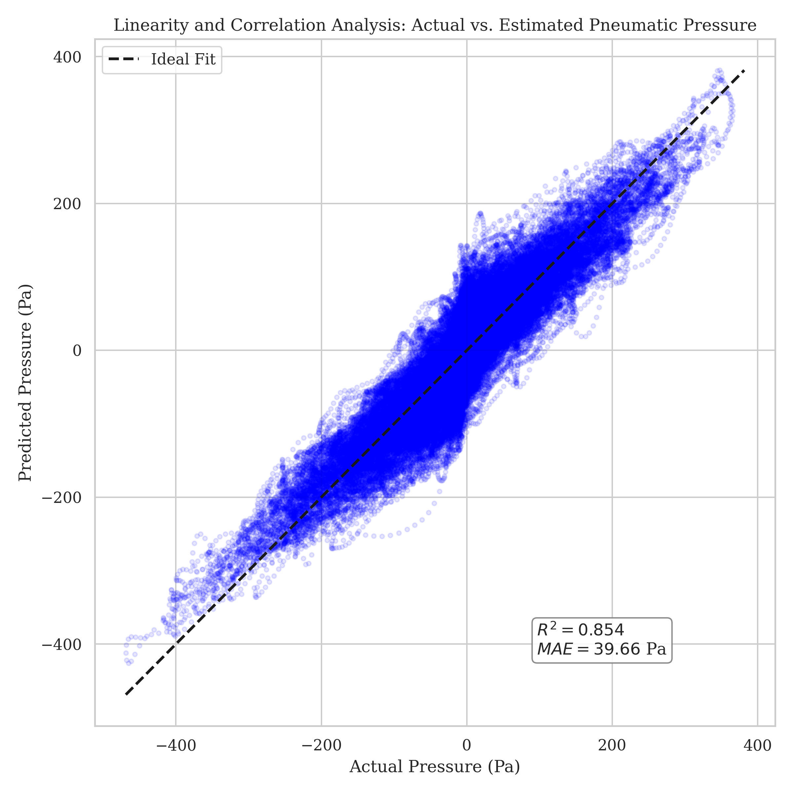

# Hydrodynamic Characterization and Virtual Pressure Sensing of an Oscillating Water Column (OWC)

[Link to Live OWC Virtual Pressure Sensing App 🌊](https://owc-virtual-pressure-sensor.streamlit.app/)

<p align="center">

</p>

This project implements a machine learning-based virtual pressure sensor to estimate the internal pneumatic chamber pressure of a fixed Oscillating Water Column (OWC) wave energy converter. By utilizing experimental basin data from the Marinet 2 testing campaign, the selected Linear Regression model achieves an **$R^2$ Score of 0.854** and an **RMSE of 39.66 Pa** on the test data (highly irregular sea states). This provides a computationally lightweight, fault-tolerant alternative to physical pressure transducers in harsh marine environments.

## 📌 Project Overview

Physical sensors deployed in offshore marine energy systems are highly susceptible to failure due to aggressive wave loading and corrosive environments. When a transducer fails, the real-time control system loses the critical data required for optimal power take-off (PTO) and grid integration.

This project addresses this vulnerability by developing a data-driven soft pressure sensor. By engineering time-lagged features from the incident wave elevation (WG1), the model captures the physical phase delay and system memory of the hydro-pneumatic coupling, accurately predicting chamber pressure under standard operational wave conditions.

## 🛠️ Technology Used

* **Machine Learning:** Scikit-learn (Linear Regression, Random Forest)
* **Web Framework:** Streamlit
* **Data Processing:** MATLAB (Signal filtering, Unit conversion), Pandas, NumPy
* **Visualization:** Plotly, Matplotlib, Seaborn
* **Dataset:** [MarinetT 2 Fixed OWC WEC Test Data Set](https://www.seanoe.org/data/00697/80895/)

## 🔳 Key Features

* **Hydro-Pneumatic Phase Delay Modeling:** Specifically designed to capture the hydrodynamic interactions within the OWC chamber, estimating how wave excitation translates into pneumatic compression and suction.
* **Time-Lagged Feature Engineering:** Transforms raw instantaneous wave elevation (WG1) into temporal memory sequences i.e. $t-0,\ t-5,\ t-10,\ \ldots,\ t-50$, explicitly modeling the physical inertia of the water column.
* **Fault-Tolerant Redundancy:** Functions as a highly interpretable, low-latency virtual pressure sensor capable of being deployed on embedded PLCs for real-time wave energy control systems.

## 📁 Repository Structure

<pre>
├── Data_Files
├── eda_model_train
│   └── eda_model_train.ipynb
├── image_assets
│   └── dashboard_preview_vps.png
├── model_assets
│   ├── owc_virtual_sensor_model.pkl
│   └── scaler.pkl
├── Processed_Data_Files
│   ├── owc_high_irregular_test_data.csv
│   ├── owc_normal_test_data.csv
│   └── owc_training_data.csv
├── results
│   ├── cross_correlation_lag_all_datasets.png
│   ├── hysteresis_analysis.png
│   ├── linearity_correlation_analysis.png
│   ├── model_performance_high_irregular_wave.png
│   ├── PSD_energy_spectrum.png
│   └── time_domain_response_all_datasets.png
├── streamlit_app
│   └── virtual_pressure_sensor.py
├── .gitignore
├── data_preprocessing.asv
├── data_preprocessing.m
├── LICENSE
├── README.md
└── requirements.txt
</pre>

## 🚀 Getting Started

### 1. Clone the Repository

```bash
git clone https://github.com/Oluwatobi-coder/OWC-Virtual-Pressure-Sensor.git
cd OWC-Virtual-Pressure-Sensor

```

### 2. Install Dependencies

```bash
pip install -r requirements.txt

```
### 3. Run the Data preprocessing and Model training files

- Open the project folder in a MATLAB environment, navigate to the `data_preprocessing.m`. Run the file to preprocess the experimental data (**Note:** ensure to download the data from the source webpage and extract the 100Hz Data Files into the 'Data_Files' folder)

- Open the project folder in a Python environment, access the `eda_model_train` directory and open the notebook, run each cell to see the EDA and model training results.


### 4. Run the Virtual Pressure Sensing App

```bash
streamlit run ./streamlit_app/virtual_pressure_sensor.py

```

## 📊 Results

| Metric | Random Forest | **Linear Regression** |
| --- | --- | --- |
| ** Score (Test Data)** | 0.841 | **0.854** |
| **RMSE (Test Data)** | 41.44 Pa | **39.66 Pa** |

### Performance Insights

<p align="center">


</p>

## 🤝 Contributing

Contributions to improve the virtual sensor are welcome. Potential areas for expansion include:

* Incorporating nonlinear feature transformations (e.g., polynomial features) to better capture extreme sea state events.
* Transitioning the predictive logic to Recurrent Neural Networks (LSTMs) for automated temporal sequence handling.

## 📚 References

* Lyden, E., Judge, F., O'shea, M., and Thiebaut, F. (2021). Marinet 2 Fixed Oscillating Water Column Wave Energy Converter Test Data Set - UCC. SEANOE. [https://doi.org/10.17882/80895](https://www.seanoe.org/data/00697/80895/)

## 📜 License

This project is licensed under the MIT License - see the `LICENSE` file for details.

If you find this virtual pressure sensing framework useful for marine renewable energy research, please ⭐ the repository!
